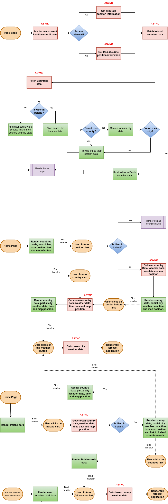
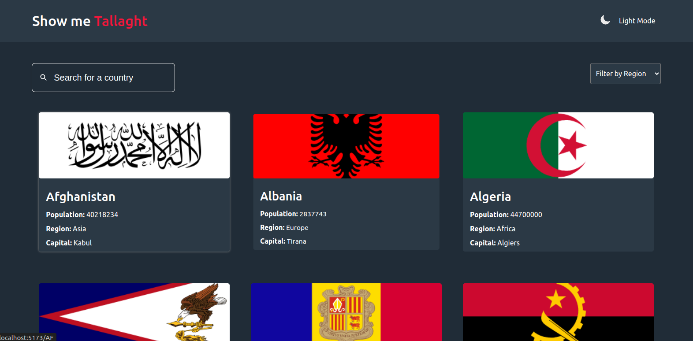
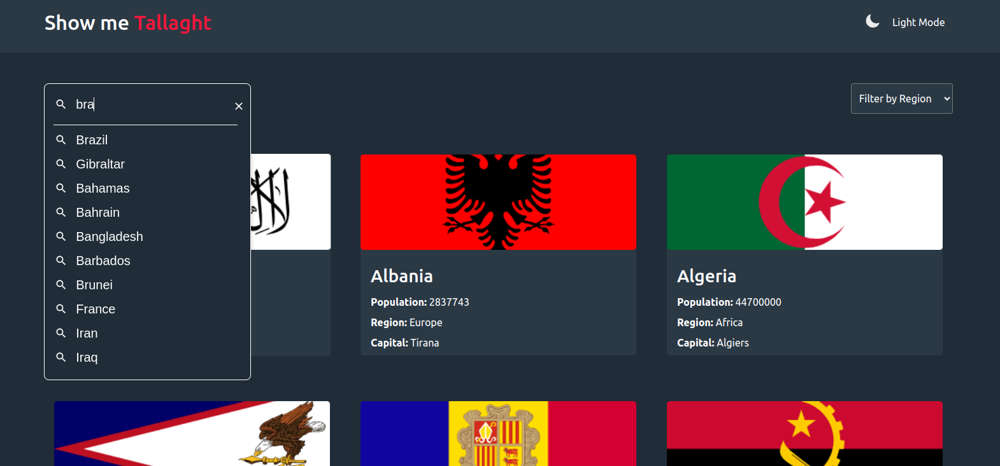
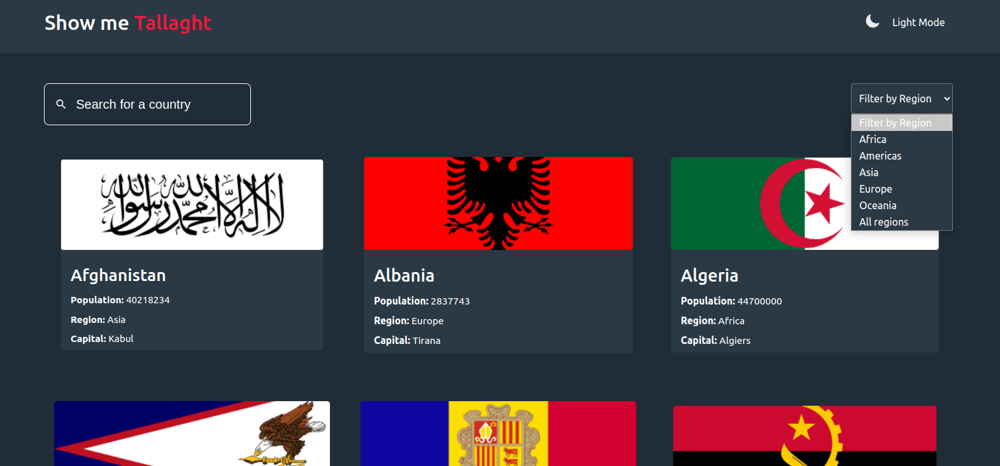
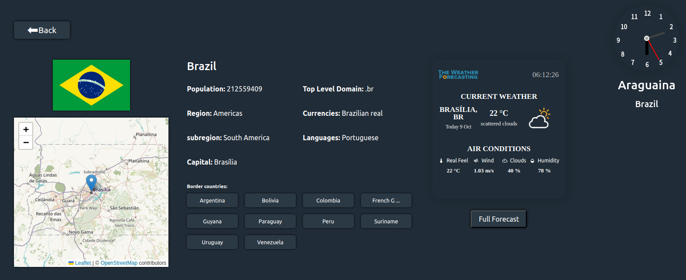
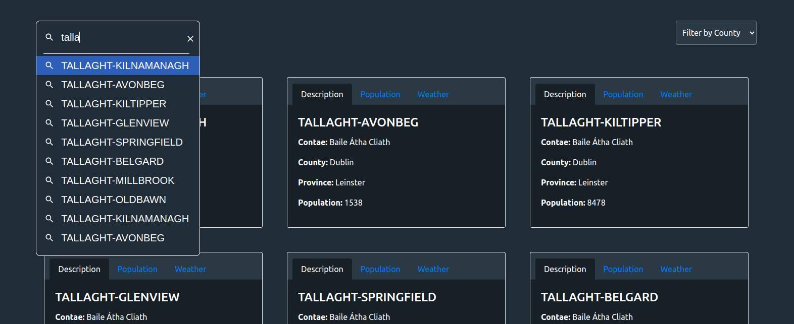
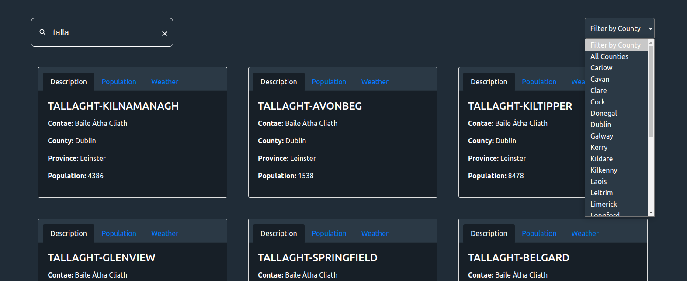
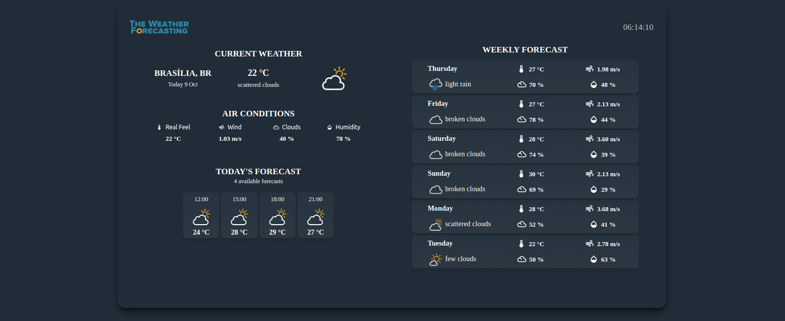

<center><h1> Multi REST API's web application </h1> </center> </br><p align="center"> </p>
  
<div style="text-align: justify">
This web application was originally built using vanilla JavaScript <a href="https://github.com/ThiagoAndo/rest-countries-api-with-color-theme-switcher-master.git">REST Countries API</a>. However, as with everything in life, growth and evolution are inevitable. To reflect my personal development, I decided to enhance the application by rebuilding it in React and integrating additional APIs to provide a more comprehensive user experience.
</br>
</br>
The updated version offers more detailed information about countries from the REST Countries API and also includes data about the user's location. I encountered many challenges along the way, but I also had a lot of fun developing this project.
</br>
</br>
I hope you enjoy using the app as much as I enjoyed building it, and that you're able to learn something from it too. If you have any questions or just want to say hello, feel free to reach out to me on X (formerly Twitter) at @Thiago09455827.
</div>

## Table of contents

- [Overview](#overview)
  - [Built using](#screenshot)
  - [APIs](#apis)
  - [Flowchart](#flowchart)
  - [Screenshot](#screenshot)
- [Local development](#local-development)
  - [Instructions](#instructions)
  - [Test](#🧪-test)
  - [Useful resources](#useful-resources)
- [Author and alive web site links](#author)

## Overview

### Users is be able to:

- See all countries from the REST Countries API on the homepage
- Search for a country using an `input` field
- Filter countries by region
- Click on a country to see more detailed information on a separate page
- Click through to the border countries on the detail page
- Click on country weather button to see the detailed forecast
- Toggle the color scheme between light and dark mode _(optional)_
- Click on given nav link and access information of their location
- See all counties in Ireland on Ireland page
- Search for an Irish county using an `input` field
- Filter Irish couties by region
- Click on links provided on the Irish cards to see information and weather detail about it

### Built using

- ReactJS
- Mui material
- Redux toolkit
- Framer motion
- Leaflet
- React router dom
- Mobiletfirst workflow
- useContext API
- React Bootstrap

### APIs

- REST Countries
- TimeZoneDB
- Geoapify
- OpenWeather
- GeoHive-(Population by Sex and Marital Status, Electoral Division, Census 2016, Theme 1.2, Ireland, 2016, CSO & Tailte Éireann)

### Flowchart

</br>
</br>
</br>

<p align="center" style="solid 1px red">
    
</p>
</br>
</br>
</br>

## Screenshot

</br>
</br>

<p align="center" style="solid 1px red">
    
     <figcaption>Fig.1 - Home page</figcaption>
</p>
</br>
</br>

<p align="center" style="solid 1px red">
    
     <figcaption>Fig.2 - Input search</figcaption>
</p>
</br>
</br>

<p align="center" style="solid 1px red">
    
     <figcaption>Fig.2 - Input fielter</figcaption>
</p>

</br>
</br>

<p align="center" style="solid 1px red">
    
     <figcaption>Fig.3 - Country detailed</figcaption>
</p>

</br>
</br>

<p align="center" style="solid 1px red">
    
     <figcaption>Fig.4 - Irish counties input search</figcaption>
</p>

</br>
</br>
<p align="center" style="solid 1px red">
    
     <figcaption>Fig.5 - Irish counties input filter</figcaption>
</p>

</br>
</br>
<p align="center" style="solid 1px red">
    
     <figcaption>Fig.5 -Full forecast application</figcaption>
</p>

</br>
</br>
</br>


## Local development

To run the project from a container, ensure that Node.js (version 14 or higher) and npm (version 7 or higher) are installed on your development machines.

### Instructions

- Fork this repository
- Clone your forked repository
- CD into the project folder
- Sing up to Geoapify, TimeZoneDB and OpenWeather APIs to optain your user keys. They all provide free services.
- Create a `.env` file in the root directory with those variables:

```shell
VITE_GEOPIFY= your Geoapify key
VITE_TIME_ZONE_KEY= your TimeZoneDB key
VITE_WEATHER_SECRETE_KEY= your OpenWeather key
```

To install the application:

```shell
npm install
```

To start the development server:

```shell
npm npm run dev
```

### 🧪 Test

After the project is installed and running, you can simulate accessing the application from abroad using Git by running the following command:

```shell
git checkout 68cedd3
```

Or if you want simulate accessing the application from a remote Irish countie run:

```shell
git checkout 272f4ad
```

## Author

- Github - [Thiago Ando de Freitas](https://github.com/ThiagoAndo)
- Alive Website - [rest-countries-api](https://rest-mult-api.netlify.app)
</br></br>
<div style="text-align: center" >
<h3 style="color:black;">"The impediment to action advances action. What stands in the way becomes the way."</h3>
<h3 style="color:black;">Marcus Aurelius </h3>
</div>
